# ACRE
Absolute Capacitive Rotary Encoder (ACRE) repository. ACRE is a cheap absolute angle sensor constructed out of pcb's.
## Introduction
This readme gives an overview of the design and build of a Absolute Capacitive Rotary Encoder (ACRE) that consists out of two simple 2-layer pcb's and a handful of components.
The ACRE is able to detect and measure the absolute angle of an axis connected to the reflector PCB from 0 to 360 degrees. The design is based uppon the working principle of a digital caliper, currently it has an accuracy of approximately 1 degrees. 
Both hardware and software could be improved if you have any suggestions let me know. In addition to this readme an EEVBLOG forum post was created for this project [Link](https://www.eevblog.com/forum/projects/absolute-capacitive-rotary-encoder-(acre)-constructed-out-of-two-pcbs/).

**Images**  
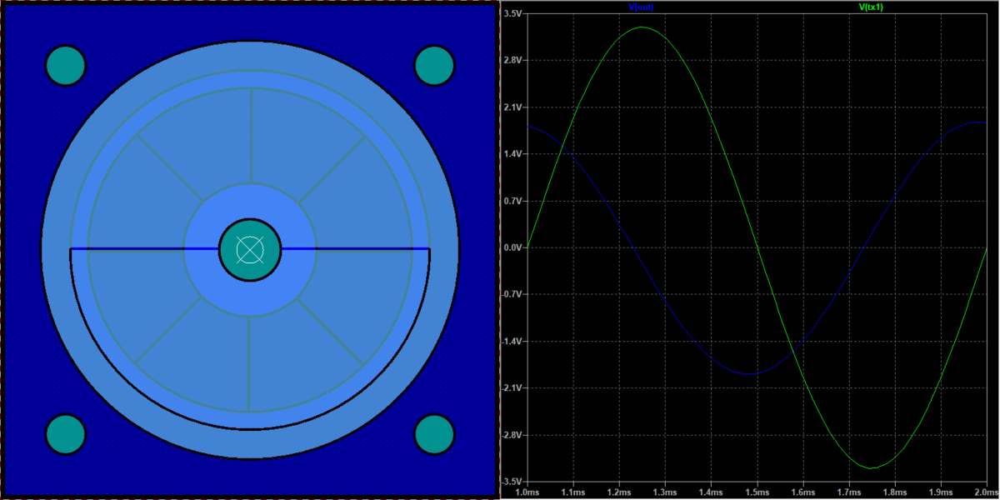

**Videos**  
These videos's were made during the assembly and testing stages.  
<a href="https://www.youtube.com/watch?v=FkHQsDzOtvA">
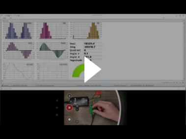
</a>  
<a href="https://www.youtube.com/watch?v=iJKz_ekD_Zw">
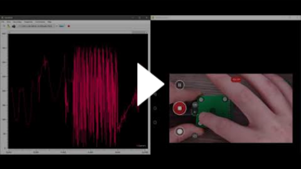
</a>  
<a href="https://www.youtube.com/watch?v=zR5dzq9aDFo">
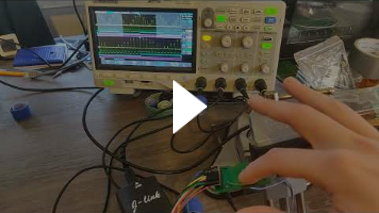
</a>  
<a href="https://www.youtube.com/watch?v=4YnHbx9MLcY">
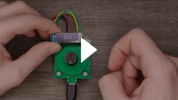
</a>  
<a href="https://www.youtube.com/watch?v=BiA69r2c_mw">
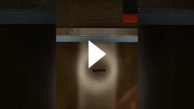
</a>  
<a href="https://www.youtube.com/watch?v=jppr43Z4cH8">
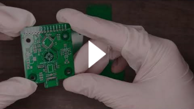
</a>  
</a>
<a href="https://www.youtube.com/watch?v=fJ5A3xmAYgY">
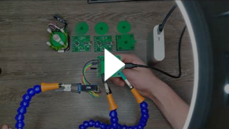
</a>  
</a>

## Working principle
 If multiple phase shifted sine waves of the same frequency are combined together the resulting waveform is a sine wave with the same frequency but with a phase shift that depends on phases of the combined signals.  
  
*8 45 degrees shifted sine waves, addition of 4 adjacent waves.*  

A capacitive displacement sensor exploits this concept by creating a mechanical sensor structure consisting out of parallel plate capacitors. These capacitors combine half of the transmission signals depending on the mechanical displacement of the sensor structure. By measuring the phase shift of the combined wave the mechanical displacement can be calculated.

**Sensor construction**  
The sensor consists out of two PCB's a transceiver PCB that holds the transmit and receiving electrodes. And a reflector PCB that rotates relative to the transceiver PCB and couples/combines 50% of the transmit signals to the receiving electrode. The other 50% is coupled to ground.  

  
*Transceiver PCB*  

  

*Reflector PCB*  
  
*Transceiver and Reflector electrodes drawn on top of each other (to better see alignment)*  

## Electronics design
Generating eight 45 degrees apart phase shifted pure analog sine waves it quite difficult so instead the sine is modulated on a PWM signal which makes it easy and cheap to implement.
 
However the signals that are used in this project aren't sine modulated PWM signals but something else instead. At the moment it is still not clear to me how these signals came to be. After many hours trying to figure out how to generate these signals from scratch I decided to clone them in stead.  
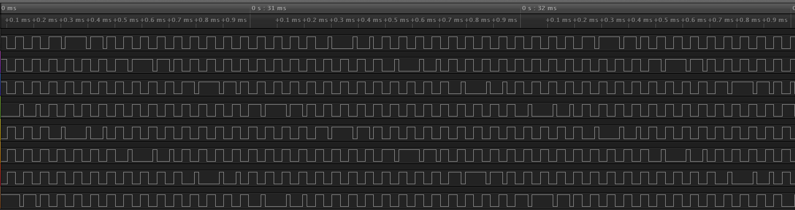  
*Transmit signals*  

**Replicating the transmission signals**  
First the caliper transmission signals were measured using a logic analyser (*\ACRE\Other\Caliper Transmission signals.logicdata*). Using the Saleae Logic software the HIGH and LOW periods of a single transmit signal for a full period (when the full signal repeats) were measured and put into a excel sheet (*\ACRE\Other\Caliper Signal sample calculation.xlsx*). Next a time period T was choosen in which the signal could be expressed. 
Using this information and a matlab script a lookup table that can be used on the MCU was created (*\ACRE\Other\signalLutGeneration.m*).

**Bias signal**  
While reverse engineering a caliper another signal was discovered on the receiving electrode. This signal was pulling the receiver electrode to ground at a fixed interval in sync with the transmit signals. I believe the purpose of this signal is to discharge the receiver electrode in between samples. This signal was deconstructed and converted to a lookup table so it could be used to replicate the signal on a MCU.

**Analog front-end**  
A analog switch is used to discharge the receiver electrode (Cp) in between samples, this switch is controlled by the bias signal.
The voltage on Cp is very small and low impedance therefore it is buffered and amplified by an op-amp before it can be sampled by the ADC.  
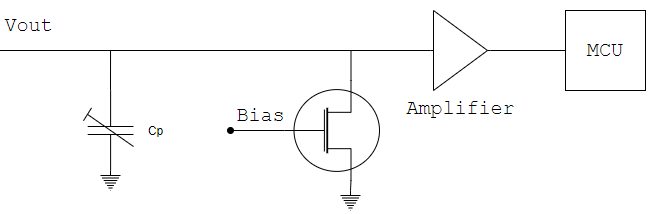  
*Analog frontend diagram*  
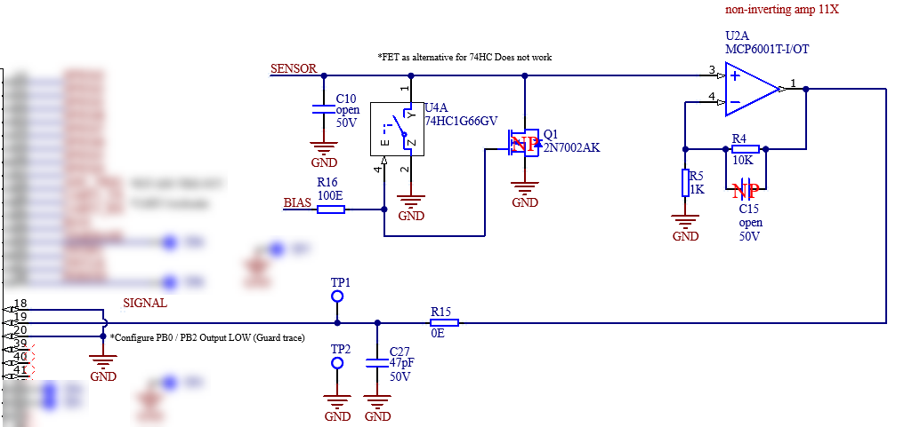  
*Analog frontend schematic V01*

**Firmware**  
The firmware was developed for the *GD32F103CBT6 - GigigaDevice*  useing the GigaDevice firmware libraries to control the peripherals. Note that the schematic lists that the STM32F103 was used, this is because I was lazy and didn't want to create a new schematic symbol at the moment and I knew these parts are practically clones of each other. Read this great article ["STM32F103 vs GD32F103"](http://smdprutser.nl/blog/stm32f103-vs-gd32f103/) for more information. Refer to BOM *"\ACRE\Hardware\Electrical\T211110V01\Ordered\T211110V01 2021-11-16\Documentation - T211110V01 2021-11-16\BOM - T211110V01 2021-11-16  23-40.xlsx"* for the used parts. The main reasoning for choosing the GigaDevice instead of the STmicroelectronics MCU was costs and availability (chip shortage) in addition I also wanted to play with the GigaDevice MCU and development tools to see if it really is a viable alternative for the ST part (yes it is).  
The code is pretty self explanetory, it generated the required lookup table for the PORTA output control register (this register controls the GPIO output pins connected to port A) for a full transmit period and loops through this table using a timer and a DMA channel to generate the required sensor signals. One of these signals is the ADC external trigger signal that is used to trigger the ADC to take a sample a specified intervals so no software overhead is needed to control the ADC. The ADC samples are stored inside a sample buffer using a DMA channel. Next the signal processing function is called to demodulate and filter the sampled signale before the phase shift is calculated using DFT, this phase shift has a direct relation with the mechanical displacement of the sensor.

## Tools
Quite a few tools were used while creating this project but I would like to highlight a few of them.

- Dough Scraper (solder paste squeegee, but cheaper) [Aliexpress](https://www.aliexpress.com/item/4000817903961.html).
- JLCPCB solder paste stencil *with frame!. I always order the stencils with a frame because this keeps the stencil flat and makes it much easier to apply solder paste correctly (see youtube videos).
- Micrium uC-Probe. This a a powerfull visual debugging tool that enables you to plot variables live from the MCU memory using the SWD interface without code overhead! (no printf needed) Sadly the website is no longer available since Silabs bought the company. However this tool was released for free by Micrium before this. I uploaded the latest setup to my file drive [here](https://tomklijn.stackstorage.com/s/DLBPp895yB4Y8s6z).
- Altium designer 21 for the schematic and PCB.
- Keil uVision 5 for the firmware development
## Next revision?
I might design a new revision in the future I pretty certain I will be able to create a version with a much higher resolution knowing what I have learned from this first prototype. Before beginning this new endeavor I would like to improve the firmware first.

## Related projects
I have developed two capacitive displacement sensor projects in the past.
The first project was a test prototype to validate if replicating the caliper technology without an ASIC was possible. And the second was a caliper constructed out of PCB's however I never ordered the PCB's for the latter because I needed to make a small change and never made time for it. I might finish the PCB caliper project in the future. Let me know if you are interrested. Below some pictures of these projects to give an impression.

**Lineair Displacement Sensor (LDS)**  
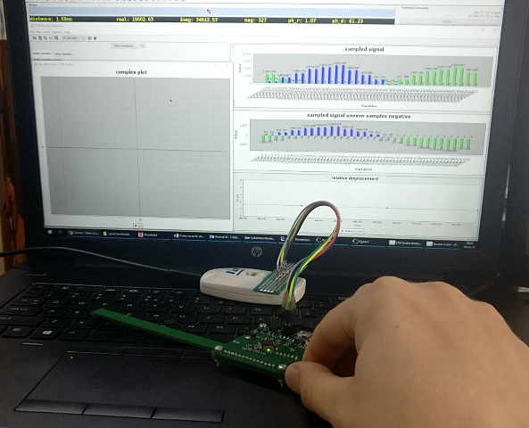  
*Photo testing LDS PCB*

**PCB Caliper**  
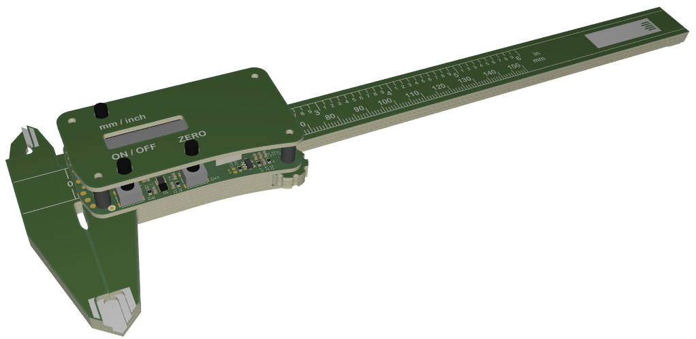  
*PCB Caliper render top*  
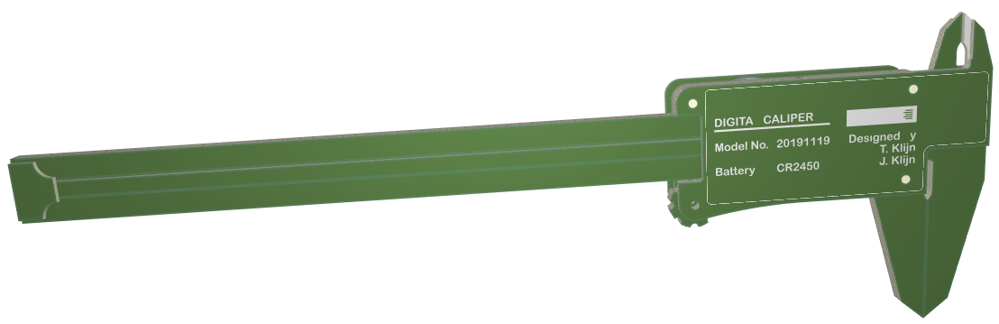  
*PCB Caliper render bottom*  
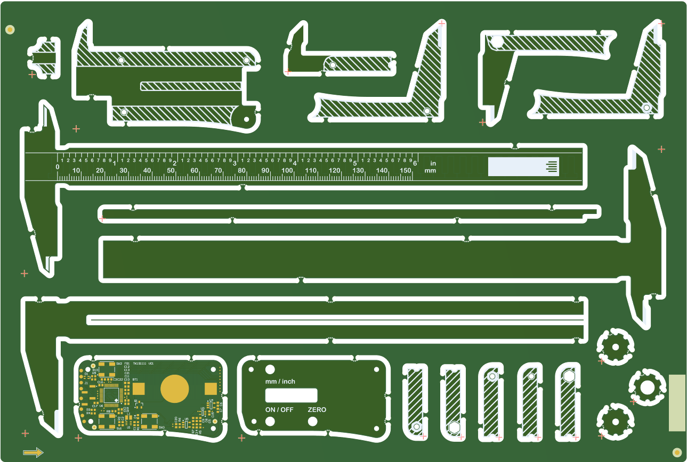  
*PCB Caliper kit panel*

## Purchasing?
[Contact me](mailto:purchase@vadernatuur.net?subject=Purchase%20ACRE) if you would like to purchase an ACRE board. I have a few assembled boards laying around collecting dust. I might even consider doing a small production run if there is interest for it. Keep in mind this project is 100% open source so I would advise building your own.
## Contributing
File bugs, feature requests in GitHub Issues.  
[Paypal donation](https://www.paypal.com/donate/?hosted_button_id=R7UZZPFKSNN7G) ☕
[Buy me a coffee](https://www.buymeacoffee.com/tomklijn) ☕  
