# ACRE
Absolute Capacitive Rotary Encoder (ACRE) repository.
This repository contains all design files used to create the ACRE.

## Introduction
This readme describes the design and build of a Absolute Capacitive Rotary Encoder (ACRE) that consists out of two simple 2-layer pcb's and a handful of components.
It can detect and measure the absolute angle of an axis from 0 to 360 degrees. By accident I also discovered it could detect my finger pretty accurately without the intended reflector pcb ([see video](https://youtu.be/iJKz_ekD_Zw?t=76)) and thus it could possibly be used for a iPod click wheel like interface.
The design is based uppon the working principle of a digital caliper currently it has an accuracy of approximately 1 degrees. 
I will explain the basic working principle here, I might do a more detailed writeup in the future if there is interest for it. The reason for publishing this project was because I think it very cool and I believe it could be useful for lots of people/projects that need absolute positional feedback. This is the first prototype so keep in mind both hardware and software could be improved if you have any suggestions please let me know. I will start with a few images and videos (Images Speak Louder Than Words).

**Images**  
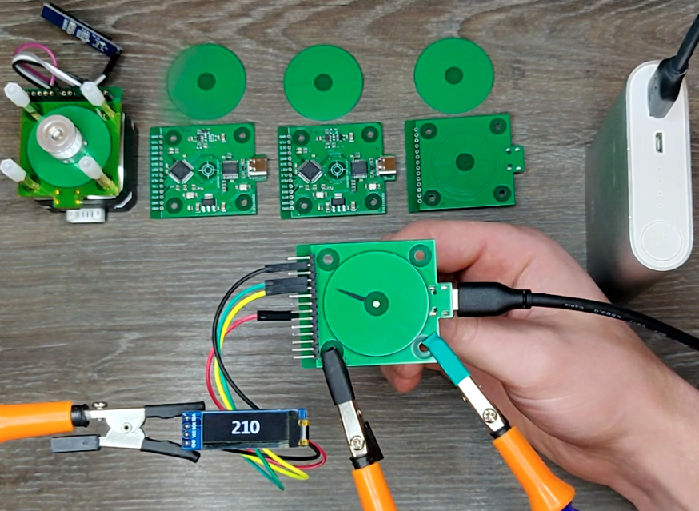
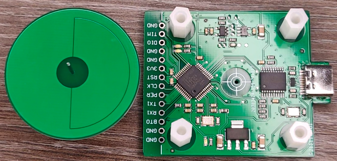
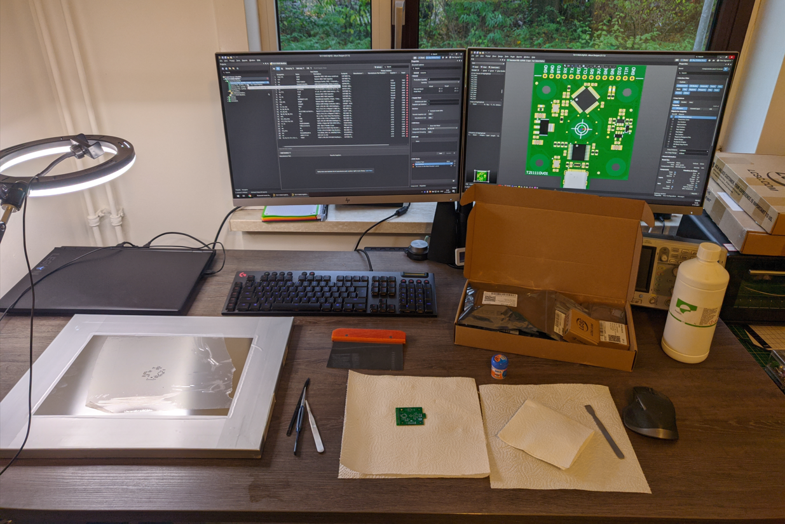
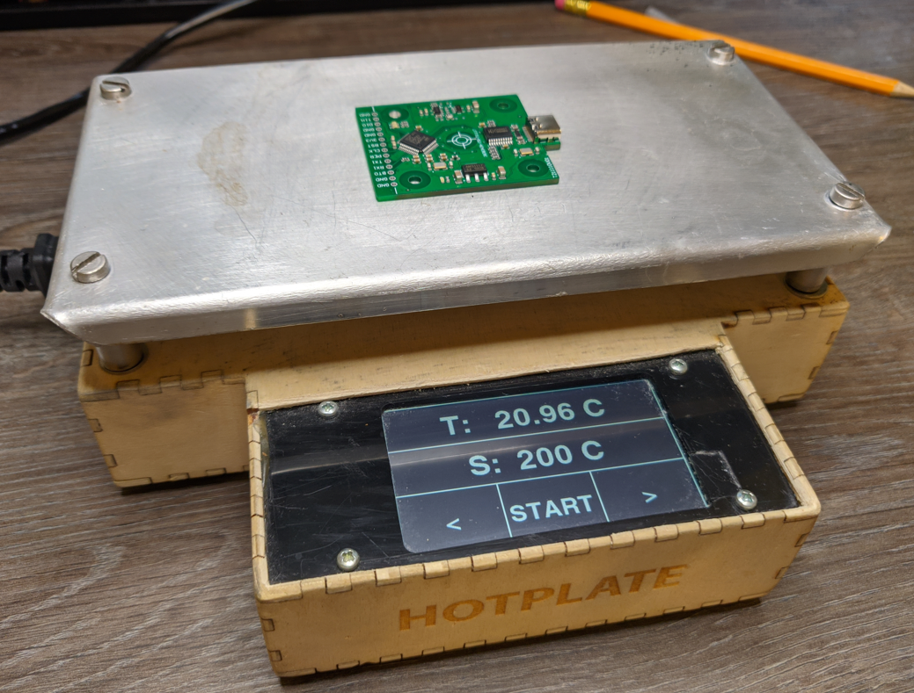
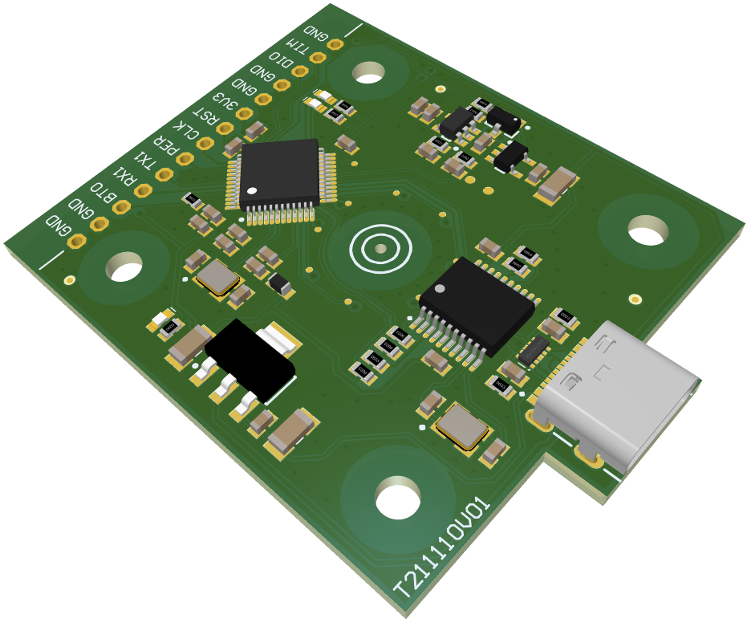
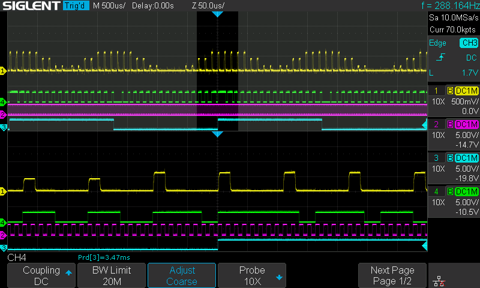
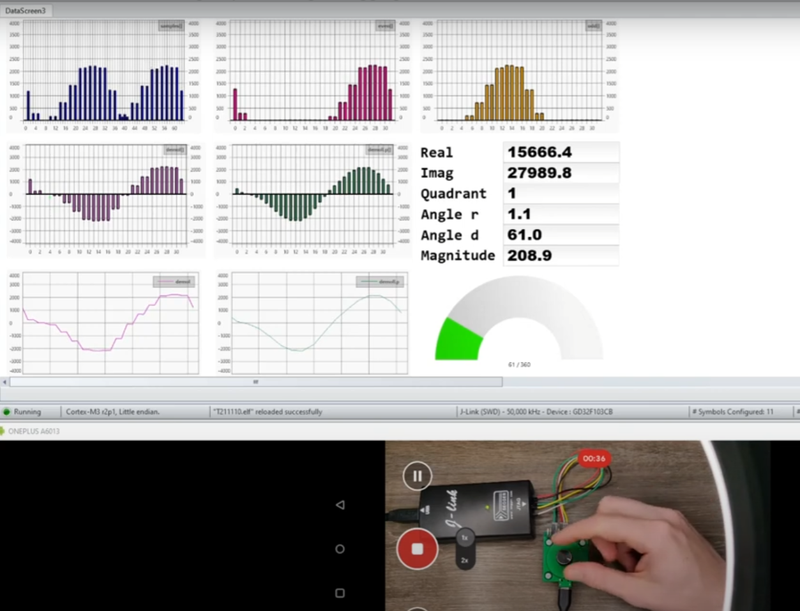

**Videos**  
I made videos's of the testing debugging and assembly process, links below. Please keep in mind these are uneddited.

- [Capacitive absolute encoder demo oled display](https://www.youtube.com/watch?v=4YnHbx9MLcY)
- [Capacitive absolute encoder demo 1](https://www.youtube.com/watch?v=fJ5A3xmAYgY)
- [Capacitive absolute encoder demo 3](https://www.youtube.com/watch?v=_CGLx_bb51s)
- [Capacitive absolute encoder solder paste application](https://www.youtube.com/watch?v=jppr43Z4cH8)
- [Capacitive absolute encoder manual assembly](https://www.youtube.com/watch?v=WzHAo4lWglU)
- [Capacitive absolute encoder solder paste application (single pcb)](https://www.youtube.com/watch?v=BiA69r2c_mw)
- [capacitive absolute encoder hardware  development and testing](https://www.youtube.com/watch?v=zR5dzq9aDFo)
- [Capacitive absolute encoder serial output testing](https://www.youtube.com/watch?v=iJKz_ekD_Zw)
- [Capacitive absolute encoder signal processing debugging](https://www.youtube.com/watch?v=FkHQsDzOtvA)

## Working principle
The sensor consists out of two parts a Transceiver PCB and a reflector PCB. 8 transmission signals are created. These signals are the same but phase shifted 45 degrees compared to each other. So imagine these signals are pure sine waves. When you add multiple sine waves of the same frequency together but with different phases the resulting waveform is a sine on with the same frequency but with a phase shift that depends on phases of the combined signals.  
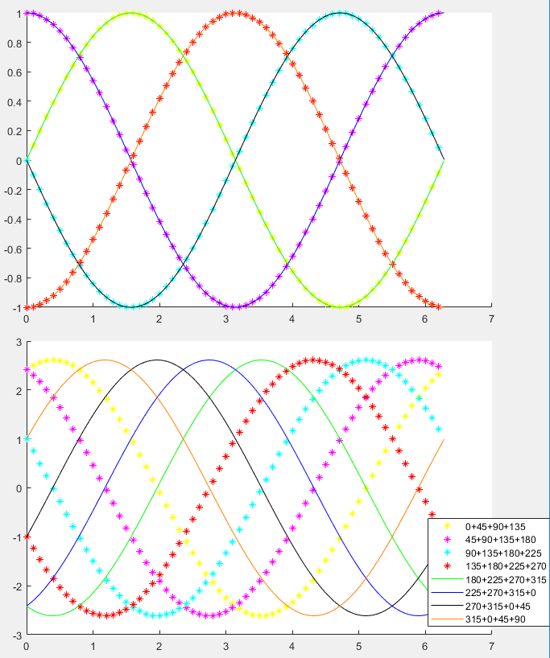  
*8 45 degrees shifted sine waves, addition of 4 adjacent waves.*  

To find out if it would work electrically I used LT spice to simulate the combination of phase shifted sine waves through capacitors. 
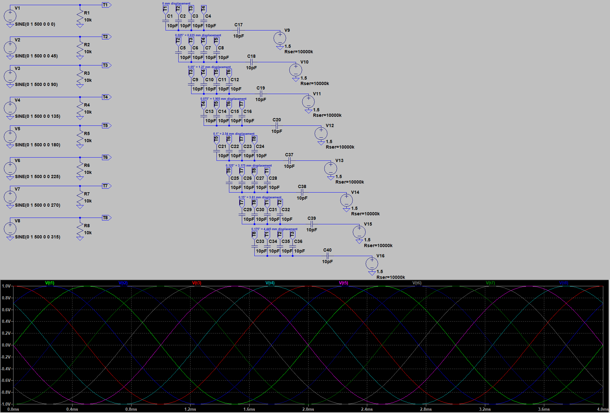  
*SPICE simultion of the comcination of phase shifted sine waves through capacitors.*

The key thing to take away is that when phase shifted sine waves of the same frequency are combined the resulting wave is of the same frequency with a phase shift that is (linearly) related to the combined waves. So if you measure combined wave you could calculate which signals were combined. Lol I hope I explained that is correct and understandable.
A capacitive displacement sensor exploits this concept to create a sensor. This sensor consists out of multiple parallel plate capacitors made out of two simple PCB's of which the capacitance changes depending on the mechanical displacement.

<ins>Sensor construction</ins>  
I have drawn the different plates of the sensor capacitors and there signal sources sepperately in the figure below. Imagine the vertical gap between the to plates that make up the reflector electrode could move up or down. Theirby determining which of the transmission signals are coupled to ground and which are coupled to the receiver electrode. At all times 50% of the transmission signals are coupled to ground and 50% to the receiver electrode.  By measuring the  phase shift of the received signal and sin(0) you can determine the location (mechanical displacement) of the reflector.

  

*hypothetical sensor capacitors design*

To implement the hypothetical design above using two pcb's the tranmit and receiver electrodes are placed on the same pcb plane in a circle (for angle measurement) as shown below.
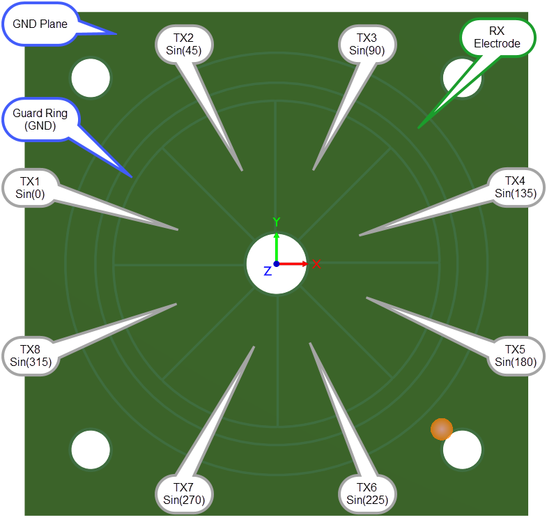  
*Transceiver PCB*  

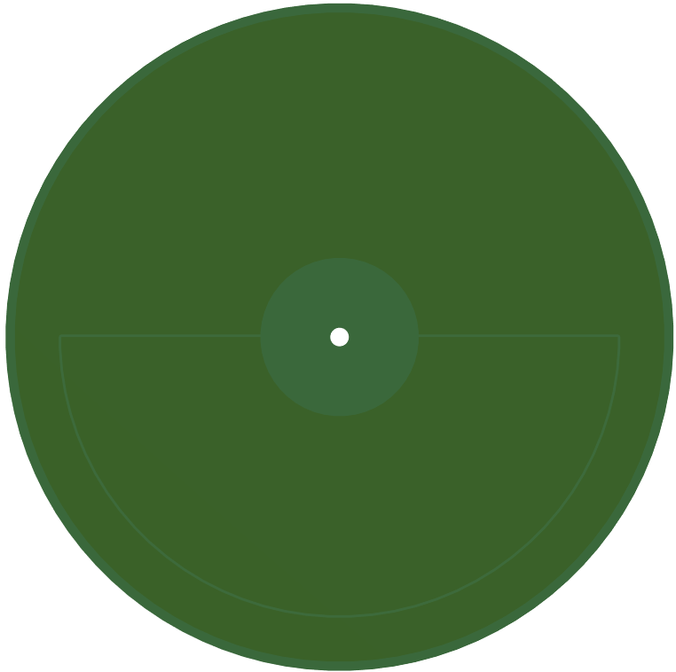  

*Reflector PCB*  

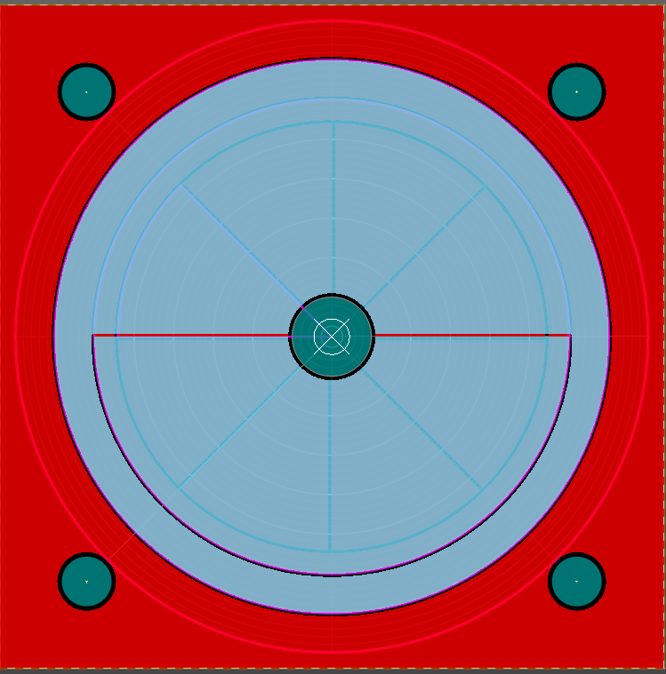  

*Transceiver and Reflector electrodes drawn on top of each other (to better see alignment)*  

